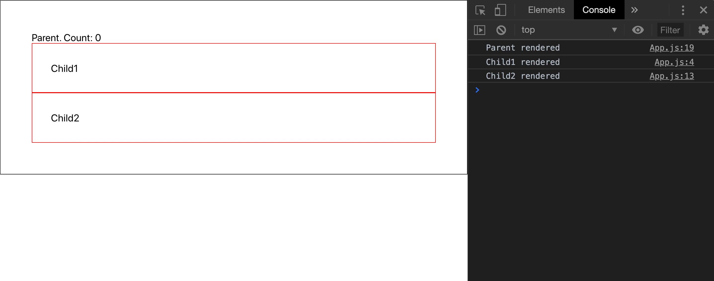

## 리액트가 똑똑한 줄 알았지만, 착각이었다

회사에서 만드는 웹 앱에 엄청나게 큰 컴포넌트 트리가 있었다. 
그리고는 뭔가를 발견했는데... 바로 위에서부터 아래 깊숙히까지 렌더링이 되고 있는 컴포넌트들이었다!
처음엔 렌더링을 방지하는 것이 마냥 쉬운 줄만 알고 있었다.


물론 컴포넌트 트리는 이것보다 훨씬 컸다. 맨 끝을 알아볼 수 없을 정도로. 필요없는 트리가 더 컸기에, 리렌더가 일어나는 게 더욱 걱정이 됐다.
위에서 아래로, `Provider`, `ConnectedRouter`, `App`, `PersistGate`, `ComponentA`, `ComponentB`, .... 이렇게 계속 내려갔다.

그리고 아직까진 우리가 우리 팀에서  `shouldComponentUpdate`/`PureComponent`/`memo`를 많이 쓰지 않는 것을 발견했다.

그래서 일단은 얘들을 어떻게든 써 보기로 했다. 아직 내 앞에 뭐가 기다리고 있는 지 모른 채...

## 깨달은 것 1: 부모 컴포넌트는 자식 컴포넌트에 대해 별로 신경쓰지 않는다

회사의 웹 앱을 관찰하면서 흥미로운 사실을 발견했다. 

회사의 코드를 들고오긴 좀 그래서 예제를 만들었다:

```js
import React, { useState } from 'react';

const Child1 = () => {
  console.log('Child1 rendered')
  return <div style = {{border: '1px solid red', padding: '30px'}}>
    Child1
  </div>
}
const Child2 = () => {
  console.log('Child2 rendered')
  return <div style = {{border: '1px solid red', padding: '30px'}}>
    Child2
  </div>
}
const Parent = () => {
  console.log('Parent rendered')

  let [count, setCount] = useState(0)
  const handleMouseEnter = () => setCount(prevCount => prevCount + 1)

  return <div onMouseEnter={handleMouseEnter} style = {{border: '1px solid black', padding: '50px'}}>
    Parent. Count: {count}
    <Child1/>
    <Child2/>
  </div>
}
export default Parent
```

이 글을 읽는 당신은 `Parent` 컴포넌트에 `mouseEnter`를 했을 때 `Child1`와 `Child2`가 리렌더를 할 것이라고 생각하는가?

한 번 보자:


아이고. **리렌더를 한다** 그렇지만 나는 왜 그런진 아직도 알진 못했다... (물론 class 컴포넌트에도 똑같은 일이 벌어진다. 궁금하면 직접 해 보는 게 좋을 것이라는 생각이다)

자식 컴포넌트들은 변경사항을 일으킬 prop이나 state도 없는데, 리렌더를 했다. 왜?? 도대체 왜?? 리액트 공식 문서를 보자:

> `shouldComponentUpdate()` is invoked before rendering when new props or state are being received. _**Defaults to true.**_ 

It defaults to true. 아... 그렇구나. 리액트는 이렇게 만들어졌단다.

그럼 어떻게 더 좋게 만들 수 있을까?

## 깨달은 것 2: `children` prop을 써라

이번 예시에 있는 단 한가지 차이점은 `children` prop을 쓴다는 것이다.

```js

(Child1, Child2 코드는 그대로)

const Parent = ({ children }) => {
  console.log('Parent rendered')

  let [count, setCount] = useState(0)
  const handleMouseEnter = () => setCount(prevCount => prevCount + 1)

  return <div onMouseEnter={handleMouseEnter} style = {{border: '1px solid black', padding: '50px'}}>
    Parent. Count: {count}
    {children}
  </div>
}
export default () => <Parent><Child1/><Child2/></Parent>
```

결과는?


**아. 자식 컴포넌트가 더 이상 리렌더를 하지 않는다**! 
아직까진 리액트가 왜 이 코드는 리렌더를 하지 않고, 방금의 코드는 리렌더를 하는지 정확하게 이해하지는 못했다. 그렇지만 이렇다는 것만 알고 있어도 충분한 도움이 될 것이라고 생각한다. 왜 그런지 아는 분은 댓글을 달아주시면 정말 감사할 것이다!

## 깨달은 점 3: `React.memo`를 쓰자

```js
import React, { useState, memo } from 'react';

const Child1 = memo(() => {
  console.log('Child1 rendered')
  return <div style = {{border: '1px solid red', padding: '30px'}}>
    Child1
  </div>
})
const Child2 = memo(() => {
  console.log('Child2 rendered')
  return <div style = {{border: '1px solid red', padding: '30px'}}>
    Child2
  </div>
})
const Parent = () => {
  console.log('Parent rendered')

  let [count, setCount] = useState(0)
  const handleMouseEnter = () => setCount(prevCount => prevCount + 1)

  return <div onMouseEnter={handleMouseEnter} style = {{border: '1px solid black', padding: '50px'}}>
    Parent. Count: {count}
    <Child1/>
    <Child2/>
  </div>
}
export default Parent
```

`memo`는 말 그대로 특정한 props를 받는 functional component를 memoize한다. 그리고 props가 만약 똑같다면, 이전에 렌더되었던 똑같은 컴포넌트를 리턴할 것이다. 
결과는 당연히 방금과 똑같다. `Child1`과 `Child2`를 리렌더하지 않는다.

혹시라도 읽기를 귀찮아 하는 분이 계실 수도 있으니 위에 있는 gif를 똑같이 복붙하겠다:


그렇다. 근데 만약 nested objects를 props로 받는 상황이라면, `areEqual`을 직접 정의해줘야 한다. 이렇게:

```js
import React, { useState, memo } from 'react';

const Child1 = memo(({ obj }) => {
  console.log(`Child${obj.number.one} rendered`)
  return <div style = {{border: '1px solid red', padding: '30px'}}>
    Child1
  </div>
})

const areEqual = (prevProps, nextProps) => 
  prevProps.obj.number.one === nextProps.obj.number.one && prevProps.obj.number.two === nextProps.obj.number.two
  
const Child2 = memo(({ obj }) => {
  console.log(`Child${obj.number.two} rendered`)
  return <div style = {{border: '1px solid red', padding: '30px'}}>
    Child2
  </div>
}, areEqual)

const Parent = () => {
  console.log('Parent rendered')

  let [count, setCount] = useState(0)
  const handleMouseEnter = () => setCount(prevCount => prevCount + 1)
  const obj = {
    number: {
      one: 1,
      two: 2,
    }
  }
  
  return <div onMouseEnter={handleMouseEnter} style = {{border: '1px solid black', padding: '50px'}}>
    Parent. Count: {count}
    <Child1 obj={obj}/>
    <Child2 obj={obj}/>
  </div>
}
export default Parent
```

일단은 그냥 `===`를 통해서 객체의 equality를 체크했다. 실제로 만약에 정말 해야 한다면,  [아마 deep equality를 체크해주는 `react-fast-compare` 같은 라이브러리를 쓸 것이다 (주의: 절대 빠르진 않다. 복잡한 객체를 빠르게 비교할 수 있는 방법은 없다. 그냥 기다려야 한다).](https://github.com/FormidableLabs/react-fast-compare)

그래서, 결과는 뭔데?



`Child1`는 `obj` prop 더 이상 동일한 걸 모른다. 왜냐하면 `memo`는 shallow comparison만 하기 때문이다.
반면에 `Child2`는 알고 있다. `areEqual` 함수가 있으니까. `Child2`는 obj가 똑같다는 걸 잘 알고 있다. 그래서 리렌더를 하지 않는다.

## 4: `PureComponent`/`shouldComponentUpdate`를 쓰자

Of course, you might wanna use your class component. So here's a brief explanation on that as well:

```js
import React, { Component, PureComponent } from 'react';

class Child1 extends PureComponent {
  render(){
    console.log(`Child${this.props.obj.number.one} rendered`)
    return <div style = {{border: '1px solid red', padding: '30px'}}>
      Child1
    </div>
  }
}

class Child2 extends Component {
  constructor(){
    super()
  }

  shouldComponentUpdate(nextProps, nextState){
    return this.props.obj.number.one !== nextProps.obj.number.one && this.props.obj.number.two !== nextProps.obj.number.two
  }

  render(){
    console.log(`Child${this.props.obj.number.two} rendered`)
    return <div style = {{border: '1px solid red', padding: '30px'}}>
      Child2
    </div>
  }
}
  
class Parent extends React.Component {
  constructor(){
    super()
    this.handleMouseEnter = this.handleMouseEnter.bind(this);
    this.state = {
      count: 0
    }
  }
  handleMouseEnter(){
    this.setState((prevState) => ({count: prevState.count + 1}));
  }
  render(){
    console.log('Parent rendered')
    const obj = {
      number: {
        one: 1,
        two: 2,
      }
    }

    return <div onMouseEnter={this.handleMouseEnter} style = {{border: '1px solid black', padding: '50px'}}>
        Parent. Count: {this.state.count}
      <Child1 obj={obj}/>
      <Child2 obj={obj}/>
    </div>
  }
}
  
export default Parent
```

위의 코드는 함수형 컴포넌트를 클래스 컴포넌트로 똑같이 구현한 것이다. 설명은 이렇다:
1. `Child`를 위해서 `PureComponent`를 썼지만, 목적을 달성하지 못한다. 왜냐하면 neested object가 prop으로 들어가기 때문이다. 부모 컴포넌트가 리렌더를 할 떄 자식 컴포넌트 자신도 리렌더를 계속 할 것이다. 하지만 object가 prop으로 들어가지 않았으면 리렌더를 막을 수 있었을 것이다.
2. `shouldComponentUpdate`를 `Child2` 위해 썼다. 그리고 이번엔 된다. `areEqual`과 같이 object를 deeply compare한다. `state`가 있는 경우에는, `nextState`를 사용하여 그것과 비교할 수 있다.
3. 번외이긴 한데, 클래스 컴포넌트를 쓸 때 boilerplate가 너무 많다. 그래서 나는 보통 함수형 컴포넌트를 개인적으로 좋아한다. 

당연하게도, 결과는 바로 위에 있었던 코드와 같다. 그래서 그냥 gif를 복붙하겠다:


## 꺠달은 점 5: 함수가 prop으로 들어갈 때 신경써주자

사실, 리액트에서는 많은 경우에 prop이 함수로 들어간다. 특히 함수를 리덕스의 `mapDispatchToProps`에 연결한다던지 (클래스 컴포넌트를 쓸 때), 또는 부모 컴포넌트에서 자식 컴포넌트에게 prop으로 함수를 내려줄 때 이런 상황이 생긴다.

함수를 신경써 주는 게 사실은 기본적인 것처럼 들릴 수도 있지만, 함수가 있는 경우엔 아무도 알지 못했던 쓸데없는 리렌더가 일어날 수 있다.

때때로 개발할 때 이런 패턴이 나올 때가 있다:

```js
import React, { useState, memo } from 'react';

const Child1 = memo(({ num, sayHiInChildren }) => {
  console.log(`Child${num} rendered`)
  sayHiInChildren('Child1')
  return <div style = {{border: '1px solid red', padding: '30px'}}>
    Child1
  </div>
})

const areEqual = (prevProps, nextProps) => 
  prevProps.num === nextProps.num && prevProps.sayHiInChildren === nextProps.sayHiInChildren
  
const Child2 = memo(({ num, sayHiInChildren }) => {
  console.log(`Child${num} rendered`)
  sayHiInChildren('Child2');
  return <div style = {{border: '1px solid red', padding: '30px'}}>
    Child2
  </div>
}, areEqual)

const Parent = () => {
  console.log('Parent rendered')
  
  let [count, setCount] = useState(0)
  const handleMouseEnter = () => setCount(prevCount => prevCount + 1)
  const sayHiInChildren = child => console.log(`hi~~~~~~~~~ - from ${child}`);
  
  return <div onMouseEnter={handleMouseEnter} style = {{border: '1px solid black', padding: '50px'}}>
    Parent. Count: {count}
    <Child1 num={1} sayHiInChildren={sayHiInChildren}/>
    <Child2 num={2} sayHiInChildren={sayHiInChildren}/>
  </div>
}
export default Parent
```

설명:
1. `obj` prop은 더 이상 object가 아니다. 그냥 `num`이다. 
2. `sayHiInChildren`이라는 함수를 `Child2`에 `prop`으로 내려준다. 
3. props가 똑같은지 shallow comparison을 한다. `Child1`와 `Child2`에서 모두. (사실 `Child1` 컴포넌트는 `areEqual` 함수를 쓰지 않고, `Child2`만 쓴다. 그렇지만 어차피 이 문맥에서는 동일한 효과가 있다). 
4. `Child1`와 `Child2`의 props가 절대 변하지 않지만 리렌더는 계속 일어날 것이다.


근데 진짜 왜..!?

자바스크립트에서는 함수를 비교할 수 있는 방법이 별로 없다.

```js
prevProps.sayHiInChildren === nextProps.sayHiInChildren
```

위의 코드는 항상 `false`다. 왜냐하면 자바스크립트에서 함수는 object고, object는 value가 아닌 reference로 비교되기 때문이다:

```js
function a() {
  console.log('we are not the same')
}
function b() {
  console.log('we are not the same')
}
a === b // false
```

`true`가 나올 수 있게 하는 단 한 가지 방법은 동일한 reference를 가질 수 있도록 해 주는 것이다:

```js
function a() {
  console.log('we are not the same')
}
const b = a
a === b // true
```

그렇다면 우리가 어떻게 props에 낑겨있는 함수에 대한 문제를 해결할 수 있을까? 

### 1. 없애버리기

`util.ts`

```js
import _ from 'lodash-es';
import isEqual from 'react-fast-compare';

const removeFunctions = (fromObj) => {
  const obj = {}
  /**
   * @description nested object properties에 속해있지 않은 함수들만 없앤다. 
   * 당연히 recursion을 사용해서 함수를 없앨 수 있다 ^^. 단지 구현하지 않았다.
   */ 
  Object.keys(fromObj).forEach(key => !_.isFunction(fromObj[key]) && (obj[key] = fromObj[key]))
  return obj
}

export const areEqual = (prevProps, nextProps) => {
  const [prev, next] = [prevProps, nextProps].map(removeFunctions);
  return isEqual(prev, next);
}
```

lodash의 `_.isFunction`을 사용해서 객체의 프로퍼티가 함수인지 확인할 수 있다. 
`removeFunctions`를 적용하면 함수가 아닌 프로퍼티들만 남게 된다. 그러면 그 props를 `areEqual`에 넣으면 된다.

```js
import React, { useState, memo } from 'react';
import { areEqual } from './util'

const Child1 = memo(({ num, sayHiInChildren }) => {
  console.log(`Child${num} rendered`)
  sayHiInChildren('Child1')
  return <div style = {{border: '1px solid red', padding: '30px'}}>
    Child1
  </div>
}, areEqual)

const Child2 = memo(({ num, sayHiInChildren }) => {
  console.log(`Child${num} rendered`)
  sayHiInChildren('Child2');
  return <div style = {{border: '1px solid red', padding: '30px'}}>
    Child2
  </div>
}, areEqual)

const Parent = () => {
  console.log('Parent rendered')
  
  let [count, setCount] = useState(0)
  const handleMouseEnter = () => setCount(prevCount => prevCount + 1)
  const sayHiInChildren = child => console.log(`hi~~~~~~~~~ - from ${child}`);
  
  return <div onMouseEnter={handleMouseEnter} style = {{border: '1px solid black', padding: '50px'}}>
    Parent. Count: {count}
    <Child1 num={1} sayHiInChildren={sayHiInChildren}/>
    <Child2 num={2} sayHiInChildren={sayHiInChildren}/>
  </div>
}
export default Parent
```

결과는? 부모 컴포넌트만 리렌더하게 된다. 함수가 아닌 props만 비교하기 때문에 가능한 일이다.


사실 이 방법은 별로 추천하진 않는다. 왜냐하면 그냥 뭔가 올바른 방법이 아니란 건 확실하기 때문이다. 무언가를 더하지 않고 없애는 거니까. 어차피 밑에 더 좋은 방법들을 소개하니까 걱정하지 마시라.

### 2. `stringify` 하기

default로는 `JSON.stringify`는 함수를 stringify하는 것을 지원하지 않는다.그래서 [jsonfn](https://github.com/vkiryukhin/jsonfn#readme)와 같은 3rd party 라이브러리를 사용해야 한다.

`util.js`

```js
import JSONfn from 'json-fn'
import isEqual from 'react-fast-compare'

export const areEqual = (prevProps, nextProps) => {
  const [prev, next] = [prevProps, nextProps].map(JSONfn.stringify)
  return isEqual(prev, next)
}
```

`JSONfn.stringify`는 이렇게 보이는 string을 만들어줄 것이다:

```js
{"num":1,"sayHiInChildren":"_NuFrRa_child => console.log(\"hi~~~~~~~~~ - from \".concat(child))"}
```

이 함수를 쓰면 이전의 예시와 동일한 결과를 가져다 줄 것이다. 복붙 한번만 더 하겠다:


이 방법의 단점은 당연히, 느리다.

그냥, 느리다. object가 크면 클 수록 느리다. 지양하자.

### 3. `useCallback` 사용하기

만약 리렌더를 방지하고 싶다면, 이것이 Functional component에서 사용할 때 가장 현명한 방법이라고 생각한다.

```js
const sayHiInChildren = useCallback(child => console.log(`hi~~~~~~~~~ — from ${child}`), [])
```

useCallback은 dependency array를 참고해서 아무것도 바뀌지 않았을 시 memoized된 callback을 반환한다 (위의 예시에서는 비어있는 배열이라서 항상 동일한 callback을 반환한다).

이렇게만 해주면 prop으로 들어가는 함수로 인한 리렌더를 방지할 수 있다.

### 4. 함수를 클래스에 bind 해 주기
`useCallback`은 모두 알다시피 함수형 컴포넌트에서밖에 쓰지 못한다. 클래스 컴포넌트에서는 이 문제를 어떻게 해결해야 할까?

사실 이미 하고 있었을 수도 있다. 이렇게 하면 된다:

```js
class Parent extends React.Component {
  sayHiInChildren = child => console.log(`hi~~~~~~~~~ - from ${child}`);

  render() {
    return <div onMouseEnter={handleMouseEnter} style = {{border: '1px solid black', padding: '50px'}}>
      Parent. Count: {count}
      <Child1 num={1} sayHiInChildren={sayHiInChildren}/>
      <Child2 num={2} sayHiInChildren={sayHiInChildren}/>
    </div>
  }
}
```

이렇게 해 주거나,

```js
class Parent extends React.Component {
  constructor(...args) {
    super(...args);
    this.sayHiInChildren = this.sayHiInChildren.bind(this);
  }

  sayHiInChildren(child){
    console.log(`hi~~~~~~~~~ - from ${child}`);
  }

  render() {
    return <div onMouseEnter={handleMouseEnter} style = {{border: '1px solid black', padding: '50px'}}>
      Parent. Count: {count}
      <Child1 num={1} sayHiInChildren={sayHiInChildren}/>
      <Child2 num={2} sayHiInChildren={sayHiInChildren}/>
    </div>
  }
}
```

이렇게만 해주면 함수를 향한 consistent reference를 유지할 수 있어서 리렌더를 방지할 수 있다.

## 끝내기 전에 꼭 말하고 싶은 것

일단 밑에 더 읽기 귀찮으면 이 말만 읽으면 좋을 것 같다: **항상 리렌더를 방지하는 게 가장 효율적인 아웃풋을 가져오는 것은 아니다.** 예를 들어 회사에서 `complexObject`라는 props을 자식 컴포넌트로 넘긴다고 치자. 이 객체는 500개가 넘는 키와 nested properties까지 가지고 있다. 그러면 아마도, 내가 이 글에서 제안한 방법보다는 그냥 맘 편하게 리렌더를 하는 게 더 좋을 것이다. 왜냐하면 리렌더를 하는 시간이 prop을 비교하는 시간보다 빠를 수도 있기 때문이다 (그리고 아마 그럴 것이다). 이건 꼭 기억해야 한다. 만약에 생각없이 memo나 deepEqual같은 함수들을 쓰고 있다면 다시 한 번 생각해보자. **다시 한 번 말하지만, 항상 optimize 를 하려고 하는 것이 좋은 것만은 아니다.**

사실 요즘 들어 더 느끼는 건 React가 참 느리다는 것이다. 

Dan Abramov가 처음에 virtual DOM과 reconciliation이라는 걸 생각해내서 뭔가 더 efficient한 느낌을 줬지만, 시간이 지나면서 그게 느리다는게 탄로(?)나고 말았다. 리액트의 ecosystem이 엄청나게 커서 리액트가 멸망? 하는 데에는 시간이 좀 걸리겠지만.. reconciliation을 버리지 않는 이상 리액트는 이대로 느린 상태가 될 것이고, 결국 svelte같은 프레임워크에 뒤처질 거란 생각이다 (근데 그게 언제가 될 진 모르겠다). 하여튼 virtual DOM은 실수였다고 생각한다. 그냥 svelte처럼 자연스러운 javascript와 html을 존중하며 따라가는게 맞았다. 그게 성능을 보존할 수 있는 방법이다.

## 요약

* `children` prop을 사용하지 않으면, `render` 함수 안에 있는 모든 컴포넌트는 기본적으로 리렌더를 할 것이다.
* 리렌더를 방지하기 위한 방법은 크게 두 가지가 있다:
  * `memo`와 `areEqual` 쓰기 (함수형 컴포넌트),
  * `PureComponent`와 `shouldComponentUpdate` 쓰기 (클래스 컴포넌트)
* props에 함수가 포함되어 있다면, `areEqual`이나 `shouldComponentUpdate`를 쓰기 전에:
  * 아예 없애버리자 (비추).
  * `stringify`하자 (비추).
  * `useCallback`을 쓰자.
  * 함수를 `bind`해서 쓰자.
